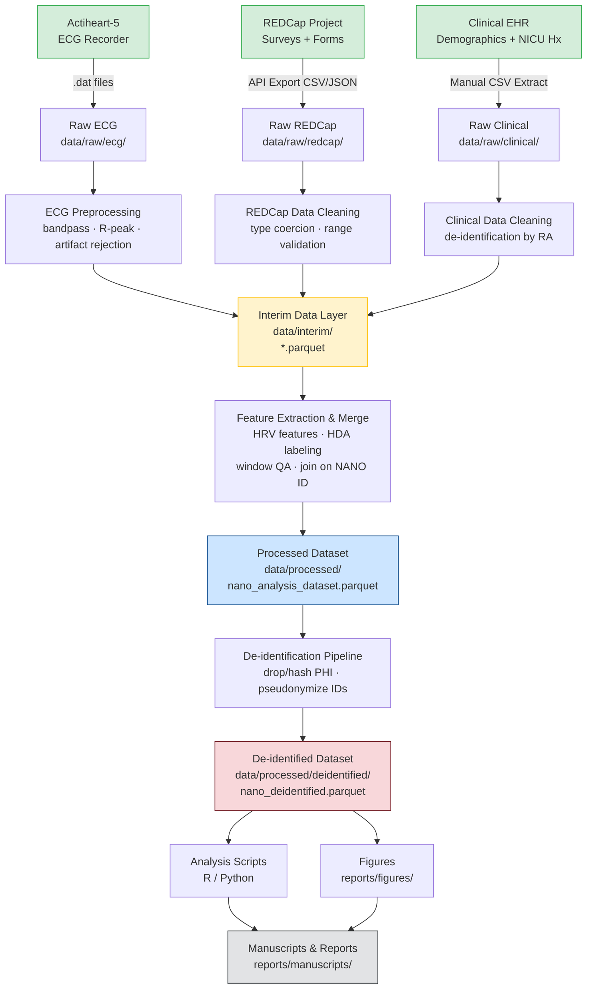

# Data Flow Diagram — NANO Study Pipeline

## Overview

This document describes the complete data flow from raw NICU physiological recordings through
final processed datasets used in manuscripts and reports.

---

## ASCII Art: Complete Data Flow

```
┌─────────────────────────────────────────────────────────────────────────────┐
│                         NICU DATA SOURCES                                    │
│                                                                               │
│  ┌─────────────────┐   ┌─────────────────┐   ┌─────────────────────────┐   │
│  │  Actiheart-5    │   │  REDCap Project  │   │  Clinical EHR / Chart   │   │
│  │  ECG Recorder   │   │  (Survey + Forms)│   │  (Demographics, NICU Hx)│   │
│  └────────┬────────┘   └────────┬────────┘   └───────────┬─────────────┘   │
└───────────┼─────────────────────┼────────────────────────┼─────────────────┘
            │                     │                          │
            ▼                     ▼                          ▼
┌───────────────────┐  ┌─────────────────────┐  ┌──────────────────────────┐
│  Raw ECG (.dat)   │  │  REDCap API Export  │  │  Manual CSV Extract      │
│  Secure Drive /   │  │  (.csv / .json)     │  │  De-identified by RA     │
│  data/raw/ecg/    │  │  data/raw/redcap/   │  │  data/raw/clinical/      │
└─────────┬─────────┘  └──────────┬──────────┘  └────────────┬─────────────┘
          │                        │                           │
          ▼                        ▼                           │
┌────────────────────┐  ┌──────────────────────┐             │
│  ECG Preprocessing │  │  REDCap Data Cleaning │             │
│  (bandpass filter, │  │  (type coercion,      │             │
│   R-peak detect,   │  │   range validation,   │             │
│   artifact reject) │  │   completeness check) │             │
└─────────┬──────────┘  └──────────┬───────────┘             │
          │                         │                          │
          ▼                         ▼                          ▼
┌─────────────────────────────────────────────────────────────────────────────┐
│                     INTERIM DATA LAYER  (data/interim/)                      │
│                                                                               │
│   ecg_ibi_interim.parquet    redcap_interim.parquet    clinical_interim.csv  │
└──────────────────────────────────────┬──────────────────────────────────────┘
                                        │
                                        ▼
                         ┌─────────────────────────────┐
                         │  Feature Extraction & Merge  │
                         │  • HRV features (RMSSD,      │
                         │    pNN50, LF/HF)             │
                         │  • HDA phase labeling        │
                         │  • Window QA scoring         │
                         │  • Join on NANO-XXXX ID      │
                         └──────────────┬──────────────┘
                                        │
                                        ▼
┌─────────────────────────────────────────────────────────────────────────────┐
│                  PROCESSED DATA LAYER  (data/processed/)                     │
│                                                                               │
│         nano_analysis_dataset.parquet   (PHI-containing, access controlled)  │
└──────────────────────────────────────┬──────────────────────────────────────┘
                                        │
                                        ▼
                         ┌─────────────────────────────┐
                         │  De-identification Pipeline  │
                         │  • Drop/hash direct PHI      │
                         │  • Generalize birth date →   │
                         │    GA + PMA only             │
                         │  • Pseudonymize participant  │
                         │    IDs (NANO-XXXX → INT)     │
                         └──────────────┬──────────────┘
                                        │
                                        ▼
┌─────────────────────────────────────────────────────────────────────────────┐
│              DE-IDENTIFIED DATA LAYER  (data/processed/deidentified/)        │
│                                                                               │
│          nano_deidentified.parquet   (shareable within IRB protocol)          │
└──────────────────────────────────────┬──────────────────────────────────────┘
                                        │
                          ┌─────────────┴──────────────┐
                          ▼                             ▼
               ┌──────────────────┐         ┌──────────────────────┐
               │  Analysis Scripts│         │  Manuscript Figures  │
               │  (R / Python)    │         │  reports/figures/    │
               └────────┬─────────┘         └──────────┬───────────┘
                        │                               │
                        └───────────────┬───────────────┘
                                        ▼
                         ┌─────────────────────────────┐
                         │     Manuscripts / Reports    │
                         │  reports/manuscripts/        │
                         └─────────────────────────────┘
```

---

## Mermaid Flowchart



---

## Pipeline Modules — Inputs and Outputs

| Module | Script / Notebook | Input | Output | Description |
|--------|------------------|-------|--------|-------------|
| ECG Ingest | `scripts/ecg_ingest.py` | `data/raw/ecg/*.dat` | `data/interim/ecg_ibi_interim.parquet` | Reads Actiheart binary files, extracts RR intervals |
| ECG Preprocessing | `src/ecg/preprocessing.py` | `ecg_ibi_interim.parquet` | `data/interim/ecg_clean_interim.parquet` | Bandpass filter, R-peak detection, artifact flagging |
| HRV Feature Extraction | `src/ecg/hrv_features.py` | `ecg_clean_interim.parquet` | `data/interim/hrv_features.parquet` | Computes time-domain and frequency-domain HRV indices |
| HDA Phase Labeling | `src/ecg/hda_labeling.py` | `ecg_clean_interim.parquet` | `data/interim/hda_phases.parquet` | Identifies HR deceleration epochs meeting HDA criteria |
| REDCap Export | `redcap/export_data.py` | REDCap API | `data/raw/redcap/*.csv` | Pulls all instruments via API with field metadata |
| REDCap Cleaning | `src/redcap/clean_redcap.py` | `data/raw/redcap/*.csv` | `data/interim/redcap_interim.parquet` | Coerces types, validates ranges, checks completeness |
| Merge Pipeline | `src/pipeline/merge.py` | All interim `.parquet` files | `data/processed/nano_analysis_dataset.parquet` | Joins ECG features with REDCap on NANO-XXXX key |
| De-identification | `src/pipeline/deidentify.py` | `nano_analysis_dataset.parquet` | `data/processed/deidentified/nano_deidentified.parquet` | Drops/hashes PHI fields per HIPAA Safe Harbor |
| Window QA | `src/ecg/window_qa.py` | `ecg_clean_interim.parquet` | `data/interim/window_qa.parquet` | Scores each epoch: marginal (>70%), good (>80%), excellent (>90%) |

---

## Data Format at Each Stage

| Stage | Location | Format | Compression | PHI Present | Notes |
|-------|----------|--------|-------------|-------------|-------|
| Raw ECG | `data/raw/ecg/` | `.dat` (binary) | None | Yes | Actiheart-5 proprietary binary |
| Raw REDCap Export | `data/raw/redcap/` | `.csv` / `.json` | None | Yes | Direct API export |
| Raw Clinical | `data/raw/clinical/` | `.csv` | None | Yes | Manual EHR extract |
| Interim ECG | `data/interim/` | `.parquet` | Snappy | Yes | Columnar; faster I/O |
| Interim REDCap | `data/interim/` | `.parquet` | Snappy | Yes | Typed, validated columns |
| Processed (PHI) | `data/processed/` | `.parquet` | Snappy | Yes | Access-controlled; USC server only |
| De-identified | `data/processed/deidentified/` | `.parquet` | Snappy | No | IRB-approved shareable format |

---

## Step Descriptions

### 1. Raw Data Ingestion
Raw ECG data arrive as binary `.dat` files from the Actiheart-5 wearable recorder placed on
participants during NICU stay. REDCap data are pulled programmatically via the REDCap API using
tokens stored in `.env`. Clinical/demographic data are exported manually from the EHR and
de-identified by a research assistant before ingest. All raw data are stored on the USC Secure
Research Server under IRB-approved access controls.

### 2. ECG Preprocessing
Raw ECG signals are bandpass filtered (0.5–40 Hz, 4th-order Butterworth), R-peaks are detected
using the Pan-Tompkins algorithm via `neurokit2`, and interbeat intervals (IBIs) are extracted.
Artifact rejection removes beats deviating >3.5 SD from a rolling median, known ectopic beats,
and movement artifact epochs flagged by accelerometer data. Each processing step is logged with
participant ID, epoch timestamp, and rejection reason.

### 3. Feature Extraction and Merging
HRV features (RMSSD, pNN50, LF power, HF power, LF/HF ratio) are computed per valid epoch.
HDA phase epochs are labeled based on sustained HR deceleration criteria. All feature tables
are joined on the participant pseudonym (NANO-XXXX) and visit event key, producing a single
wide-format analysis parquet. Window-level QA scores are attached to enable downstream
filtering by quality threshold.

### 4. De-identification and Dissemination
The PHI-containing processed dataset is transformed by the de-identification pipeline:
direct identifiers are dropped or cryptographically hashed, birth dates are replaced with
gestational/post-menstrual age integers, and NANO-XXXX IDs are mapped to sequential integers.
The resulting de-identified parquet is the input for all analysis scripts, figure generation,
and manuscript preparation, and may be shared with collaborators under the existing data use
agreement.
