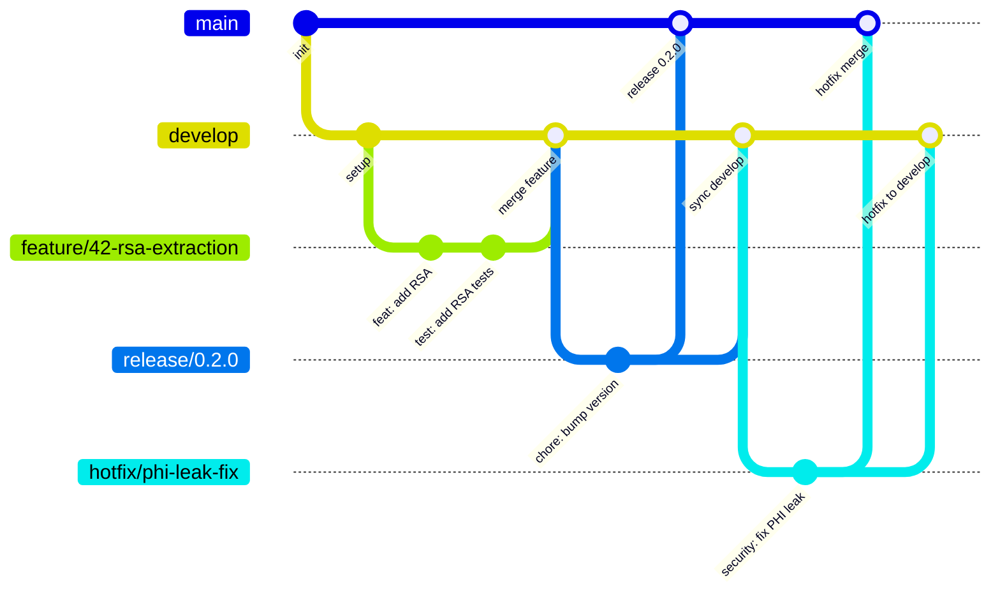

# Git Workflow — NANO Study Repository

## Branch Structure



## Branching Rules

| Branch | Purpose | Branch From | Merge Into | Protected |
|--------|---------|-------------|------------|-----------|
| `main` | Production-stable code | — | — | Yes (PR required) |
| `develop` | Integration branch | `main` | `main` via release | Yes (CI must pass) |
| `feature/*` | New features | `develop` | `develop` | No |
| `hotfix/*` | Critical fixes | `main` | `main` + `develop` | No |
| `release/*` | Release prep | `develop` | `main` + `develop` | No |

## Commit Message Types

| Type | When to Use | Example |
|------|------------|---------|
| `feat` | New capability | `feat(ecg): add RSA via CWT` |
| `fix` | Bug fix | `fix(redcap): handle empty export` |
| `docs` | Documentation | `docs: update onboarding guide` |
| `test` | Tests | `test(hrv): add RMSSD edge cases` |
| `refactor` | Restructure | `refactor(pipeline): extract loader` |
| `security` | HIPAA / security | `security: remove PHI from logs` |
| `data` | Data dictionary / config | `data: add CSBS field mappings` |
| `chore` | Build / CI | `chore: update black to 24.x` |

## If PHI Is Accidentally Committed

**Act immediately — do not push if caught locally:**

```bash
# 1. Stop — do not push to remote
# 2. Remove the file and purge from history
pip install git-filter-repo
git filter-repo --path path/to/phi_file.csv --invert-paths
# 3. Force push (requires PI authorization)
git push origin --force --all
# 4. Report to PI and USC IRB within 24 hours
# 5. Rotate any credentials that were in the committed file
```

If already pushed to GitHub: contact GitHub Support immediately to purge caches, then notify USC IRB.

## PR Review Process

1. Author opens PR from `feature/` → `develop`
2. CI must pass (pytest + black + flake8)
3. At least 1 reviewer approves
4. Author squash-merges after approval
5. Delete feature branch after merge
