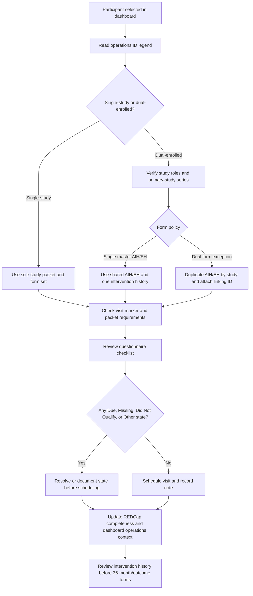

# Participant Operations Workflow

This document is the dashboard-facing source of truth for participant role
identification, dual-enrollment scheduling, form routing, questionnaire states,
and intervention-history review. It is de-identified and should be reviewed in
lab meeting before changes are promoted into REDCap source forms.

## Participant ID Legend

| Code pattern | Meaning | Standard rule |
| --- | --- | --- |
| `NANO-5###` | NANO-primary single-study participant | Use the 5-series for NANO-primary operations IDs. |
| `NICO-9###` | NICO-primary single-study participant | Use the 9-series unless a backend data pull requires the source ID. |
| `ANONICO-9###` | ANONICO-primary single-study participant | Use the 9-series unless a backend data pull requires the source ID. |
| `DUAL-5###` or `DUAL-9###` | Dual-enrolled participant | The series follows the primary study; linked forms use the shared linking ID. |

Visit markers are attached to scheduling and packet routing: `NICU`, `CGA-03`,
`CGA-06`, `CGA-09`, `CGA-12`, `CGA-18`, `CGA-24`, and `CGA-36`.

## Dual-Enrollment Form Policy

Default policy: use one master AIH and one master EH for a dual-enrolled
participant. The form follows the participant across studies, and intervention
history is reviewed in one chronological record.

Exception policy: use duplicate study-specific AIH/EH forms only when a REDCap
or backend data-pull rule requires separate source forms. In that case, the
dashboard must show a linking ID, and both duplicate forms must remain digitally
connected.

Single-study policy: use the participant's sole study packet and no cross-study
duplication.

## Required Workflow States

Every checklist or form state should use one of these values:

| State | Use when |
| --- | --- |
| `Complete` | Required item is present and ready for the visit or data pull. |
| `Due` | Item is expected for the next visit and must be checked before scheduling. |
| `Missing` | Required item is absent and should block packet readiness. |
| `Did Not Qualify` | Participant or form path was reviewed and does not apply. |
| `Other` | Staff need to record a tracked non-standard outcome. |

Do not leave operational decisions blank when `Did Not Qualify` or `Other`
better captures the outcome.

## Scheduling Checklist

1. Confirm the participant operations code, study role, enrollment type, and
   visit marker.
2. Check whether the participant is single-study or dual-enrolled before
   offering visit dates.
3. Confirm the AIH/EH policy and linking ID before assigning REDCap packets.
4. Cross-check packet requirements and questionnaire checklist against study
   role, enrollment type, and visit marker.
5. Review intervention history in order:
   baseline AIH, EH update, intervention exposure, visit history, then
   36-month review.
6. Record `Did Not Qualify` or `Other` when the participant does not follow a
   standard path.

## Current-State Flow

## Lab Meeting Review Items

1. Approve the 5-series versus 9-series numbering convention and document any
   backend data-pull exceptions.
2. Confirm that single master AIH/EH is the default dual-enrollment policy.
3. Identify any study-specific form duplication requirements that need a
   linking ID.
4. Confirm the questionnaire checklist and packet requirements for each study
   role and visit marker.
5. Decide whether any additional workflow states are needed beyond Complete,
   Due, Missing, Did Not Qualify, and Other.
